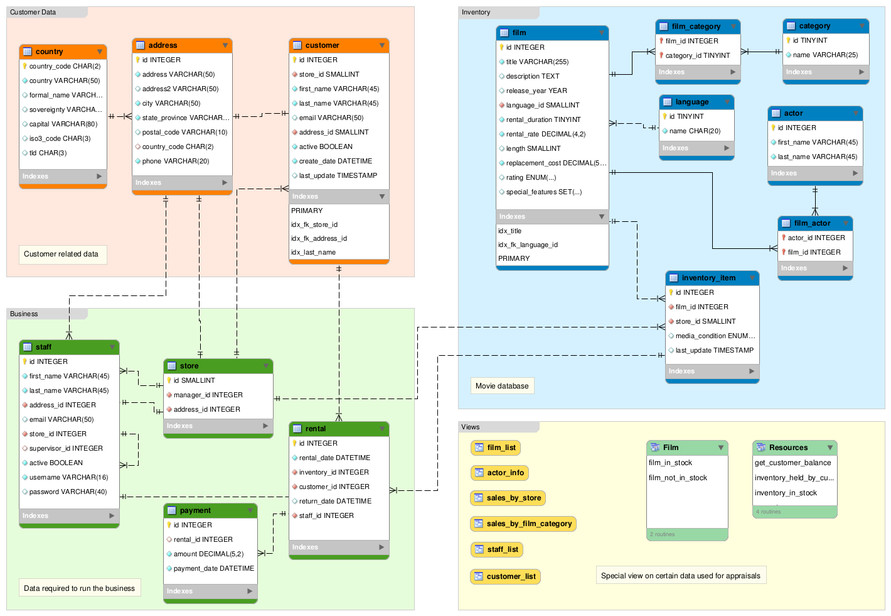

# FilmQueryProject

## Description:
This program follows several programming frameworks including but not limited to Data Access Object (DAO) pattern and Object Relational Mapping (ORM). This Project utilizes JDBC and Maven to connect to a database that contains several tables. The Program accesses the database using a DAO and following ORM, puts the data retrieved into their respective object either actor or film. The program will loop giving the user several options of dynamic SQL statements based on user input. All of which are listed below. One thing I am particularly happy with in this project is how robust the application is. There are several use cases in which a poor input from a user will be handled as well as bad data received from the DB.
The biggest weakness for this program is that if the DataBase were to grow larger than 2147483647 rows the application would not be able to reach id's past 2147483647. This is because for the sake of speed and memory efficiency although it may be nominal, we choose to use int primitives for method inputs. This could be resolved by refactoring the code to use long for method inputs instead and parse user inputs with the Long.parseLong static method but this would decrease program efficiency overall. 

- A diagram of the database is linked below, and zip file of DB is within the project.

## Tech Used:
- Maven
- Java
- JDBC
- MySQL

## SQL Statements:
- SELECT id, first_name, last_name FROM actor WHERE id = ?;
 
Will retrieve actor information based on the actor id chosen by user.

- SELECT * FROM film JOIN film_actor ON film.id = film_actor.film_id WHERE actor_id = ?;
 
Will retrieve film information based on a actor id chosen by user.

- SELECT * FROM film WHERE film.id = ?;
 
Will get all data from film table.

- SELECT * FROM film WHERE title like %?% or description like %?%;
 
Will get films matching the key word provided by user.

- SELECT COUNT(inventory_item.film_id) FROM inventory_item WHERE film_id
= ? GROUP BY inventory_item.film_id;
  
Will get the number of occurences of film id in the inventory table.

- SELECT actor.id, actor.first_name, actor.last_name FROM actor join film_actor on actor.id = film_actor.actor_id WHERE film_id = ?;
 
Will get all actors in a given film based on film id provided by user.

- SELECT category.name FROM category JOIN film_category ON category.id = film_category.category_id JOIN film ON film_category.film_id = film.id WHERE film.id = ?;
 
Will get the genre of a film based on film id provided by user.

- SELECT language.name FROM film JOIN language ON language.id = film.language_id WHERE film.id = ?
 
Will find the language a film is in based on film by id.

## Lessons Learned:
- Object Relational Mapping, Data Access Object framework
- Using Statement objects as opposed to PreparedStatements will make the program vulnerable to SQL Injection attacks. This is because Statement allows string concatenation where PreparedStatments do not. 
- Although not used in this project several MySQL functions were researched and discovered.
- Utilizing Connection, PreparedStatement, ResultSet Objects.

## DataBase Diagram:

